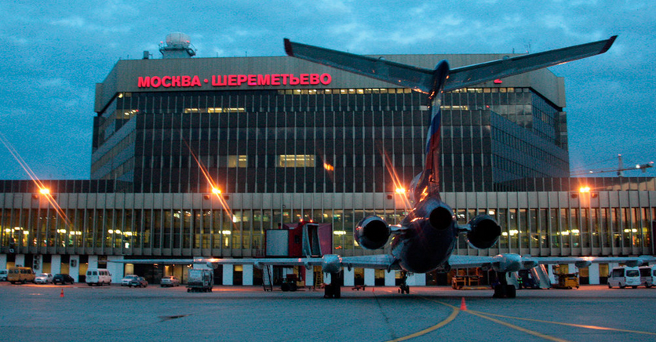

# *Transito Aereo en Rusia*

## Índice de contenidos
* [Introduccion](#item1)
* [Contenido](#item2)
* [Inspiracion](#item3)
* [Documentación y ejecución end2end](#item4)

#### Introduccion

La fabricación de aviones es un sector industrial importante en Rusia, da empleo a alrededor de 355.300 personas. El desmembramiento de la Unión Soviética sumergió a la industria en una profunda crisis, especialmente para el segmento de la aviación civil. La situación comenzó a mejorar hacia mediados de la primera década de los 2000 debido a un crecimiento en el transporte aéreo y a la creciente demanda. Un programa de consolidación iniciado en 2005 condujo a la creación del holding Corporación Aeronáutica Unida, que incluye la mayoría y más importantese empresas del sector. 
Luego de pequeña introduccion, mostramos en este punto, este pequeño Dataset con aeropuertos, vuelos, horarios, destinos y diversa informacion para explorar y descubrir destinos y areas cubiertas por la aeronavegacion comercial de Rusia.
Dentro del analisis que podemos hacer realizando consultas a este Dataset tenemos:
- Consultar aeropuertos disponibles por nombre del aeropuerto.
- Consultar aeropuertos disponibles por ciudad.
- Consultar aeropuertos disponibles por zona horaria.
- Consultar rutas con origen/destino por nombre de las ciudades o nombre de los aeropuertos.
- Consultar fechas y horarios de partidas y arrivos mediante el numero de vuelo.
- Consultar por numero de TT datos del pasajero.
- Ubicar geograficamente una ciudad.

[Subir](#top)

#### Contenido

Este conjunto de datos, originalmente compartido y actualizado aquí, incluye datos de líneas de transporte de varias ciudades de Rusia, incluidas como Moscu, San Petersburgo, Kaliningrado, Vladivastok, Perm, Ekaterimburgo y otras tantas ciudad que cubren muchos miles de kilómetros de líneas aereas rusas.

[Subir](#top)

#### Inspiración

El viajar y descubrir nuevos lugares desde el punto de vista humano, siempre ha sido unos de los motores que mantienen activa a las personas en busca de mejores vias de comercio, turismo y distintas actividades donde el conocimiento de datos precisos como destinos, origenes y horarios, es de vital importancia.
Puede explorar geometrías para generar mapas e incluso ver cómo las líneas surcan los cielos rusos.

[Subir](#top)

#### Documentación y ejecución end2end

En el siguiente apartado se describe una vitacora de como se resolvio el TP paso a paso y como crear un script en [BASH](russiafly-end2end.md) para poder ejecutar todo el proceso end2end desde la creación del container, operaciones de DDL, carga de datos y consultas.

##### Ejecucion

1.`git clone https://github.com/itba-cloud-data-engineering/tpf-foundations-marcelogramma.git`

2.`cd tpf-foundations-marcelogramma/`

3.`docker-compose up`

Luego de esto se vera en pantalla el desarrollo del lazamiento de la aplicacion. Al finalizar el mismo veremos una url del tipo http://127.0.0.1:2222, donde se podra ingresar via un explorador web al gestor PGAdmin4. Desde este se podra gestionar la base de datos, hacerle consultas y recorrer la estructura de la mismas
En pantalla tambien se veran las consultas y sus respectivas respuestas desde el Dataset.

Enjoy!
