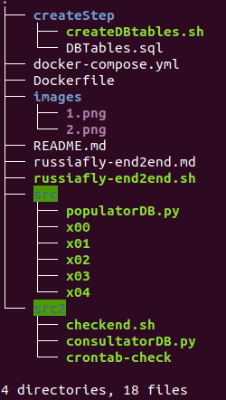

# *Transito Aereo en Rusia*


#### Resolucion de los ejercicios
##### Arbol de archivos


##### Resolucion Ejercicio 1

Este punto es solo la eleccion del Dataset y consultas, todo explayado en el Readme

##### Resolucion Ejercicio 2

- Puesta en marcha del motor de postgreSQL

Se crea un pipeline donde se define el orquestador y el diseño de la imagen del primer container. Este container es llamado main partiendo de una imagen de postgres:13.3. Este crea una imagen de nombre mybdpostgres:stable. Se le definen en docker-compose.yml variables de entorno y variables del motor de la base de datos. Tambien se expone, tanto a la red docker como al localhost el port estandard de postgres (5432) y se pasan valores como usuario, pass, allow_empy_password y postgres_host_aut_method. Por otro lado en el Dockerfile se define comandos de incio en el docker como RUN y CMD con los cuales se llevan a cabo operaciones basicas de copiado de distintos scripts. El container tiene como nombre db_postgres. En este punto ya el motor de postgreSQL se encuentra operativo y listo para operar.

##### Resolucion Ejercicio 3

- Creacion de la Base de Datos y Operaciones DDL

Este ejercicio viene concatenado al ejercicio anterior, ya que luego de la copia de scripts en el build de container, se ejecutan dichos scripts, el cual uno de ellos es un script de Bash (createDBtables.sh) el cual esta dividido en dos partes. La primera parte es la que se encarga de la creacion de la Base de Datos. Finalizado este proceso, se ejecuta un segundo comando dentro de este Bash el cual se encarga de crear todas las tablas y operaciones DDL en la base de datos, pero sin dato alguno. En este punto la Base de Datos se encuentra operable y puede atender peticiones, pero aun no cuenta con data dentro de la misma

##### Resolucion Ejercicio 4

- Populacion de la Base de Datos y ultimas configuraciones contrain de la BD

En este punto el orquestador tiene directivas de crear un container con la imagen de python:3.9-buster llamado python_populator, en el cual tiene directivas de instalar modulos de python tales como psycopg2, arc y argis los cuales son modulos utilizados por python para conectarse a una Base de Datos. Tambien se actualiza el SO y se instala posrgresql-13. Este ultimo se utiliza para popular la Base de Datos. Este container esta linkeado al anterior container (main) y depede de este, para luego via tcp por DNS, se conecten entre si y popule la Base de Datos. Al finalizar estos puntos, se ejecuta un script creado en python llamado populatorDB.py. Este mediante modulos como psycopg2 y os, descomprime el archivo .gz de los datos y ejecuta psql enviando toda la data a la Base de Datos. El script que se ejecuta en este punto es el populatorDB.py. Al finalizar estos procesos, se mostrara en pantalla un mensaje de espera.

##### Resolucion Ejericicio 5

- Realizar consultas a la Bases de Datos e imprimirlas en pantalla

En este ounto el orquestador tiene directivas de crear un contaier con la imagen python:3.9-buster  llamdo python_consultator, el cual se encarga de consultar la Base de Datos y mostrar sus resultados en pantalla. Tiene directivas de instalar modulos de python tales como psycopg2 y tambien instala cron y vim. El cron es usado para verificar cuando el container anterior, llamado python_populator termine. Esto lo hace mediante un cron de un minuto que corre un script en bash (checkend.sh) el cual mediante un ping al host python_populator, detecta si esta up o down. Si este aun esta up y responde, es porque aun no termino de popular la Base de Datos, informando en pantalla que Python Populator not Ready Yet. Cuando este termine, el mismo cron, vera que salio el otro container con exit0 y ejecutara un script en python (consultatorDB.py) y mostara en mantalla las respuestas de las consultas realizadas a la Base de Datos.
ConsultatorDB.py contiene una clase,  File manager la cual copia la salida de las consultas a un archivo pp.log, el cual desde el container es leido por un tail -f. Por ende se renueva en pantalla cada 1 minuto las consultas a la Base de Datos. Tambiene estas consultas son guardadas dentro del container en /tmp/pp.log y en la maquina local en 
/src/pp.log. Para las consultas a la Base de Datos se uso pandas, ya que es mas que inteligente para relacionar tablas al realizar joins a las mismas.

##### Resolucion Ejercicio 6

- Redaccion de este articulo y como realizar un script en bash para ejecutar todo directamente.

- Crear un archivo llamado [russiafly-end2end.sh](russiafly-end2end.sh).
 ```$ touch russiafly-end2end.sh```
 
- Darle permiso de ejecucion
```$ chmod g+x russiafly-end2end.sh```
     
- Editar el archivo creado
```$ vi russiafly-end2end.sh```

- Introducir el siguiente codigo

```
#!/bin/bash
#
git clone https://github.com/itba-cloud-data-engineering/tpf-foundations-marcelogramma.git
cd tpf-foundations-marcelogramma/
docker-compose up
```


- Ejecutarlo
```$ bash russiafly-end2end.sh```
      
##### Ejercicio 7 (fue opcional agregado por mi)

En este punto, el orquestador tiene directivas de crear un container mas que actua como front-end con una web de gestion del motor y la Base de Datos (pgAdmin). El nombre de este container es  web_pgadmin4. Este permite conectarse , administrar y recorrer el servidor postgres como tambien consultar la Base de Datos. 
Esto se hace  ingresando a la url http://127.0.0.1:2222 . Puede realizar consultas al Dataset, administrar el servidor Postgres, ver diagrama ER y mucho mas, 
		 http://127.0.0.1:2222 Password: admin 
	Luego agrege un Servidor nuevo con la direccion main o 127.0.0.1 
	Usuario Base de Datos: postgres   -   Sin password 

Enjoy!!!
